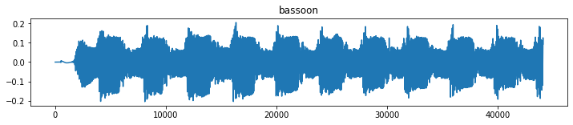

This is the main notebook. Note that the /all_samples/ folder contains mp3 files, which have to be converted to wav first.  
Convert mp3 to wav.ipynb takes care of this - the final audio folder should be /all_samples_wav/

# Import libraries


```python
import os
import numpy as np
import librosa as lr
import pandas as pd
import keras
import pickle
import keras.initializers
import tensorflow as tf
import matplotlib.pyplot as plt
import seaborn as sns

from tqdm import tqdm
from keras.layers import Conv2D, MaxPool2D, Flatten, Dense, Dropout
from keras.models import Sequential
from keras.regularizers import l2
from sklearn.model_selection import train_test_split
from sklearn.metrics import recall_score, precision_score, accuracy_score
from sklearn.metrics import confusion_matrix, f1_score, classification_report
from sklearn.preprocessing import StandardScaler
from sklearn.preprocessing import LabelEncoder, OneHotEncoder
```


```python
print("Num GPUs Available: ", len(tf.config.experimental.list_physical_devices('GPU')))
```

    Num GPUs Available:  1
    


```python
# Set directory for source files

ROOT = "all_samples_wav"
folders = os.listdir(ROOT) # names of subfolders
file_data = [] # filenames in each of the 58 folders

TARGET_SECONDS = 2
sr = 22050
target_num_samples = sr*TARGET_SECONDS

n_fft = 1024
hop_length = 512
n_mfcc = 13
```

# Statistics about the dataset


```python
for label in tqdm(range(len(folders))):
    sub_dir = os.listdir(f'{ROOT}/{folders[label]}')
    file_data.append(sub_dir)
```

    100%|█████████████████████████████████████████████████████████████████████████████████| 20/20 [00:00<00:00, 589.82it/s]
    


```python
amounts = []

for i in range(len(file_data)):
    amounts.append(len(file_data[i]))
col1 = np.array(folders)
col2 = np.array(amounts)
merge = {'folder': col1, 'amount': col2}

df = pd.DataFrame(merge, columns=['folder', 'amount'])
                   
print(f'Total amount of samples: {sum(amounts)}')

df
```

    Total amount of samples: 13681
    


<div>
<style scoped>
    .dataframe tbody tr th:only-of-type {
        vertical-align: middle;
    }

    .dataframe tbody tr th {
        vertical-align: top;
    }

    .dataframe thead th {
        text-align: right;
    }
</style>
<table border="1" class="dataframe">
  <thead>
    <tr style="text-align: right;">
      <th></th>
      <th>folder</th>
      <th>amount</th>
    </tr>
  </thead>
  <tbody>
    <tr>
      <th>0</th>
      <td>banjo</td>
      <td>74</td>
    </tr>
    <tr>
      <th>1</th>
      <td>bassoon</td>
      <td>720</td>
    </tr>
    <tr>
      <th>2</th>
      <td>bass_clarinet</td>
      <td>944</td>
    </tr>
    <tr>
      <th>3</th>
      <td>cello</td>
      <td>889</td>
    </tr>
    <tr>
      <th>4</th>
      <td>clarinet</td>
      <td>846</td>
    </tr>
    <tr>
      <th>5</th>
      <td>contrabassoon</td>
      <td>710</td>
    </tr>
    <tr>
      <th>6</th>
      <td>cor_anglais</td>
      <td>691</td>
    </tr>
    <tr>
      <th>7</th>
      <td>double_bass</td>
      <td>852</td>
    </tr>
    <tr>
      <th>8</th>
      <td>flute</td>
      <td>878</td>
    </tr>
    <tr>
      <th>9</th>
      <td>french_horn</td>
      <td>652</td>
    </tr>
    <tr>
      <th>10</th>
      <td>guitar</td>
      <td>106</td>
    </tr>
    <tr>
      <th>11</th>
      <td>mandolin</td>
      <td>80</td>
    </tr>
    <tr>
      <th>12</th>
      <td>oboe</td>
      <td>596</td>
    </tr>
    <tr>
      <th>13</th>
      <td>percussion</td>
      <td>148</td>
    </tr>
    <tr>
      <th>14</th>
      <td>saxophone</td>
      <td>732</td>
    </tr>
    <tr>
      <th>15</th>
      <td>trombone</td>
      <td>831</td>
    </tr>
    <tr>
      <th>16</th>
      <td>trumpet</td>
      <td>485</td>
    </tr>
    <tr>
      <th>17</th>
      <td>tuba</td>
      <td>972</td>
    </tr>
    <tr>
      <th>18</th>
      <td>viola</td>
      <td>973</td>
    </tr>
    <tr>
      <th>19</th>
      <td>violin</td>
      <td>1502</td>
    </tr>
  </tbody>
</table>
</div>


Load audio data


```python
# audio_data = []
# 
# for dirname, _, filenames in tqdm(os.walk(ROOT)):
#     for filename in filenames:
#         src = f'{dirname}/{filename}'
#         audio_data.append(lr.load(src))
```

Save/Load audio_waves array


```python
# Save
# with open('audio_data.pickle', 'wb') as f:
#     pickle.dump(audio_data, f)
```


```python
# Load
with open('audio_data.pickle', 'rb') as f:
    audio_data = pickle.load(f)
```

Create dataframe overview


```python
fname = []
classID = []
num_samples = []

df1 = pd.DataFrame(np.array(audio_data, dtype=object), columns=['signal', 'samplerate'])

for i in range(df1.shape[0]):
    num_samples.append(len(df1['signal'].iloc[i]))
num_samples = np.array(num_samples)

for dirname, _, filenames in os.walk(ROOT):
    for filename in filenames:
        fname.append(filename)
        classID.append(dirname[16:])
fname = np.array(fname)
classID = np.array(classID)

df1['num samples'] = num_samples
df1['seconds'] = df1['num samples']/df1['samplerate']
df1['fname'] = fname
df1['classID'] = classID

# round seconds
df1['seconds'] = df1['seconds'].apply(pd.to_numeric, errors='coerce').round(1)

df1
```


<div>
<style scoped>
    .dataframe tbody tr th:only-of-type {
        vertical-align: middle;
    }

    .dataframe tbody tr th {
        vertical-align: top;
    }

    .dataframe thead th {
        text-align: right;
    }
</style>
<table border="1" class="dataframe">
  <thead>
    <tr style="text-align: right;">
      <th></th>
      <th>signal</th>
      <th>samplerate</th>
      <th>num samples</th>
      <th>seconds</th>
      <th>fname</th>
      <th>classID</th>
    </tr>
  </thead>
  <tbody>
    <tr>
      <th>0</th>
      <td>[0.0, 0.0, 0.0, 0.0, 0.0, 0.0, 0.0, 0.0, 0.0, ...</td>
      <td>22050</td>
      <td>76608</td>
      <td>3.5</td>
      <td>banjo_A3_very-long_forte_normal.wav</td>
      <td>banjo</td>
    </tr>
    <tr>
      <th>1</th>
      <td>[0.0, 0.0, 0.0, 0.0, 0.0, 0.0, 0.0, 0.0, 0.0, ...</td>
      <td>22050</td>
      <td>77184</td>
      <td>3.5</td>
      <td>banjo_A3_very-long_piano_normal.wav</td>
      <td>banjo</td>
    </tr>
    <tr>
      <th>2</th>
      <td>[0.0, 0.0, 0.0, 0.0, 0.0, 0.0, 0.0, 0.0, 0.0, ...</td>
      <td>22050</td>
      <td>84096</td>
      <td>3.8</td>
      <td>banjo_A4_very-long_forte_normal.wav</td>
      <td>banjo</td>
    </tr>
    <tr>
      <th>3</th>
      <td>[0.0, 0.0, 0.0, 0.0, 0.0, 0.0, 0.0, 0.0, 0.0, ...</td>
      <td>22050</td>
      <td>69696</td>
      <td>3.2</td>
      <td>banjo_A4_very-long_piano_normal.wav</td>
      <td>banjo</td>
    </tr>
    <tr>
      <th>4</th>
      <td>[0.0, 0.0, 0.0, 0.0, 0.0, 0.0, 0.0, 0.0, 0.0, ...</td>
      <td>22050</td>
      <td>85248</td>
      <td>3.9</td>
      <td>banjo_A5_very-long_forte_normal.wav</td>
      <td>banjo</td>
    </tr>
    <tr>
      <th>...</th>
      <td>...</td>
      <td>...</td>
      <td>...</td>
      <td>...</td>
      <td>...</td>
      <td>...</td>
    </tr>
    <tr>
      <th>13676</th>
      <td>[0.0, 0.0, 0.0, 0.0, 0.0, 0.0, 0.0, 0.0, 0.0, ...</td>
      <td>22050</td>
      <td>48960</td>
      <td>2.2</td>
      <td>violin_Gs6_1_mezzo-forte_natural-harmonic.wav</td>
      <td>violin</td>
    </tr>
    <tr>
      <th>13677</th>
      <td>[0.0, 0.0, 0.0, 0.0, 0.0, 0.0, 0.0, 0.0, 0.0, ...</td>
      <td>22050</td>
      <td>28800</td>
      <td>1.3</td>
      <td>violin_Gs6_1_piano_arco-sul-tasto.wav</td>
      <td>violin</td>
    </tr>
    <tr>
      <th>13678</th>
      <td>[0.0, 0.0, 0.0, 0.0, 0.0, 0.0, 0.0, 0.0, 0.0, ...</td>
      <td>22050</td>
      <td>34560</td>
      <td>1.6</td>
      <td>violin_Gs6_1_piano_natural-harmonic.wav</td>
      <td>violin</td>
    </tr>
    <tr>
      <th>13679</th>
      <td>[0.0, 0.0, 0.0, 0.0, 0.0, 0.0, 0.0, 0.0, 0.0, ...</td>
      <td>22050</td>
      <td>51840</td>
      <td>2.4</td>
      <td>violin_Gs6_phrase_pianissimo_arco-normal.wav</td>
      <td>violin</td>
    </tr>
    <tr>
      <th>13680</th>
      <td>[0.0, 0.0, 0.0, 0.0, 0.0, 0.0, 0.0, 0.0, 0.0, ...</td>
      <td>22050</td>
      <td>31680</td>
      <td>1.4</td>
      <td>violin_Gs7_1_mezzo-forte_natural-harmonic.wav</td>
      <td>violin</td>
    </tr>
  </tbody>
</table>
<p>13681 rows × 6 columns</p>
</div>


```python
%matplotlib inline
x = df1['seconds']

plt.hist(x, density=False, bins=150, range=(0,5))  # density=False would make counts
plt.ylabel('Amount of files')
plt.xlabel('Seconds');

print(f"Shortest sample length: {np.min(df1['num samples'])}sm (~ {np.min(df1['seconds'])} seconds), longest: {np.max(df1['num samples'])}sm (~ {np.max(df1['seconds'])} seconds)")
print(f"Average length in seconds: {np.round(np.mean(df1['seconds']), decimals=1)}")
```

    Shortest sample length: 1728sm (~ 0.1 seconds), longest: 1711296sm (~ 77.6 seconds)
    Average length in seconds: 1.9
    


    

    


Bring all soundfiles to the desired length of 2 seconds


```python
processed_audio = []

for i in range(len(audio_data)):
    signal = audio_data[i][0]
    
    # shorten if too long, right-pad if too short
    if len(signal) > target_num_samples:
        processed_audio.append(signal[:target_num_samples])
        
    if len(signal) < target_num_samples:
        num_missing_samples = target_num_samples - len(signal)
        last_dim_padding = (0, num_missing_samples)
        processed_audio.append(np.pad(signal, last_dim_padding, mode='constant'))
        
processed_audio = np.array(processed_audio, dtype=float)
```

Save/load processed_audio_data


```python
# Save
# with open('processed_audio.pickle', 'wb') as f:
#     pickle.dump(processed_audio, f)
```


```python
# Load
with open('processed_audio.pickle', 'rb') as f:
    processed_audio = pickle.load(f)
```


```python
processed_audio.shape
```


    (13681, 44100)


# Feature extraction

Methods and extraction


```python
def mfcc_scale(mfcc):
    scaler = StandardScaler()
    mfcc = scaler.fit_transform(np.array(mfcc))
    return mfcc

def calc_mfcc(signal):
    return lr.feature.mfcc(y=signal, n_mfcc=n_mfcc, sr=sr)
```


```python
mfcc_features = []

for i in tqdm(range(len(processed_audio))):
    mfcc_features.append(mfcc_scale(calc_mfcc(processed_audio[i])))
    
mfcc_features = np.array(mfcc_features)
```

    100%|███████████████████████████████████████████████████████████████████████████| 13681/13681 [02:00<00:00, 113.28it/s]
    

Save/load mfcc_features


```python
# Save
with open('mfcc_features.pickle', 'wb') as f:
    pickle.dump(mfcc_features, f)
```


```python
# Load
# with open('mfcc_features.pickle', 'rb') as f:
#     mfcc_features = pickle.load(f)
```


```python
print(processed_audio.shape)
print(mfcc_features.shape)
```

    (13681, 44100)
    (13681, 13, 87)
    

# Extract and plot a single sound file

ex. shortened file


```python
test_nr = 310
plt.figure(figsize=(12,2))
plt.plot(processed_audio[test_nr])
plt.title(f'{classID[test_nr]}')
plt.show()
plt.figure(figsize=(15, 2))
plt.imshow(mfcc_features[test_nr], vmin=0, vmax=1)
plt.title(classID[test_nr])
plt.show()
print(f'{fname[test_nr]}; original: {len(audio_data[test_nr][0])}sm -> {target_num_samples}sm')
```


    

    


    

    


    bassoon_C4_long_forte_tremolo.wav; original: 101376sm -> 44100sm
    

ex. padded file


```python
test_nr = 5001
plt.figure(figsize=(12,2))
plt.plot(processed_audio[test_nr])
plt.title(classID[test_nr])
plt.show()
plt.figure(figsize=(15, 2))
plt.imshow(mfcc_features[test_nr], vmin=0, vmax=1)
plt.title(classID[test_nr])
plt.show()
print(f'{fname[test_nr]}; original: {len(audio_data[test_nr][0])}sm -> {target_num_samples}sm')
```


    

    


    

    


    double-bass_As3_1_mezzo-piano_arco-normal.wav; original: 28224sm -> 44100sm
    

Encoding the labels<br>
'banjo' -> '0',<br>
...<br>
'violin' -> '20'<br>
Followed by one-hot-encoding


```python
label_encoder = LabelEncoder()
label_encoded = label_encoder.fit_transform(classID)
label_encoded = label_encoded[:, np.newaxis]
```


```python
one_hot_encoder = OneHotEncoder(sparse=False)
one_hot_encoded = one_hot_encoder.fit_transform(label_encoded)
```

# Create train and test sets

Intuitive labelling for data, normalization of features, stratified splitting to account for<br>
the inbalances in the dataset


```python
X = mfcc_features
y = one_hot_encoded
X = (X-X.min())/(X.max()-X.min()) # Normalization
X_train, X_test, y_train, y_test = train_test_split(X, y, 
                                                    stratify=y, 
                                                    test_size=0.2,
                                                    shuffle=True, 
                                                    random_state=8)

X_train, X_val, y_train, y_val = train_test_split(X_train, y_train, 
                                                  stratify=y_train, 
                                                  test_size=0.25, 
                                                  shuffle=True, 
                                                  random_state= 8)
```


```python
input_shape = (X_train.shape[1], X_train.shape[2], 1)
```


```python
input_shape
```


    (13, 87, 1)


```python
# X_train = X_train.reshape(X_train.shape[0], X_train.shape[1], X_train.shape[2], 1)
# X_test = X_test.reshape(X_test.shape[0], X_test.shape[1], X_test.shape[2], 1)

print("X_train shape: {}".format(X_train.shape))
print("X_test shape: {}".format(X_test.shape))
print("y_train shape: {}".format(y_train.shape))
print("y_test shape: {}".format(y_test.shape))
print("X_val shape: {}".format(y_train.shape))
print("y_val shape: {}".format(y_test.shape))
```

    X_train shape: (8208, 13, 87)
    X_test shape: (2737, 13, 87)
    y_train shape: (8208, 20)
    y_test shape: (2737, 20)
    X_val shape: (8208, 20)
    y_val shape: (2737, 20)
    

# Training


```python
# Training parameters

num_epochs = 100
# num_steps = 1000
activation = 'relu'
last_act = 'Softmax'
kernel_init = 'he_normal'
dense_init = keras.initializers.HeNormal()
regularizer = l2(0.01)
padding = 'same'
loss = 'categorical_crossentropy'
optimizer = 'adam'
metrics = 'acc'
filter_dim = (3, 3)

# Early stopping parameters
callback = keras.callbacks.EarlyStopping(monitor='loss', patience=3)
```

CNN Architecture


```python
model = Sequential()
model.add(Conv2D(16, filter_dim, activation=activation, strides=(1, 1), padding=padding, input_shape=input_shape, kernel_initializer=kernel_init))
# model.add(MaxPool2D((2, 2), padding=padding))

model.add(Conv2D(32, filter_dim, activation=activation, strides=(1, 1), padding=padding, kernel_initializer=kernel_init))
# model.add(MaxPool2D((2, 2), padding=padding))

model.add(Conv2D(64, filter_dim, activation=activation, strides=(1, 1), padding=padding, kernel_initializer=kernel_init))
model.add(MaxPool2D((2, 2), padding=padding))

model.add(Conv2D(128, filter_dim, activation=activation, strides=(1, 1), padding=padding, kernel_initializer=kernel_init))
model.add(MaxPool2D((2, 2), padding=padding))

model.add(Flatten())
model.add(Dense(512, activation=activation, kernel_initializer=dense_init, kernel_regularizer=regularizer))
model.add(Dropout(0.3))
model.add(Dense(1024, activation=activation, kernel_initializer=dense_init, kernel_regularizer=regularizer))
model.add(Dropout(0.2))
model.add(Dense(512, activation=activation, kernel_initializer=dense_init, kernel_regularizer=regularizer))
model.add(Dense(20, activation=last_act))

model.compile(loss=loss, optimizer=optimizer, metrics=[metrics])
```


```python
model.summary()
```

    Model: "sequential"
    _________________________________________________________________
     Layer (type)                Output Shape              Param #   
    =================================================================
     conv2d (Conv2D)             (None, 13, 87, 16)        160       
                                                                     
     conv2d_1 (Conv2D)           (None, 13, 87, 32)        4640      
                                                                     
     conv2d_2 (Conv2D)           (None, 13, 87, 64)        18496     
                                                                     
     max_pooling2d (MaxPooling2D  (None, 7, 44, 64)        0         
     )                                                               
                                                                     
     conv2d_3 (Conv2D)           (None, 7, 44, 128)        73856     
                                                                     
     max_pooling2d_1 (MaxPooling  (None, 4, 22, 128)       0         
     2D)                                                             
                                                                     
     flatten (Flatten)           (None, 11264)             0         
                                                                     
     dense (Dense)               (None, 512)               5767680   
                                                                     
     dropout (Dropout)           (None, 512)               0         
                                                                     
     dense_1 (Dense)             (None, 1024)              525312    
                                                                     
     dropout_1 (Dropout)         (None, 1024)              0         
                                                                     
     dense_2 (Dense)             (None, 512)               524800    
                                                                     
     dense_3 (Dense)             (None, 20)                10260     
                                                                     
    =================================================================
    Total params: 6,925,204
    Trainable params: 6,925,204
    Non-trainable params: 0
    _________________________________________________________________
    

Train


```python
history = model.fit(X_train, y_train, 
                    # steps_per_epoch=num_steps,
                    initial_epoch=0,
                    epochs=num_epochs, 
                    validation_data=(X_val, y_val), 
                    shuffle=True,
                    callbacks=[callback])
```

    Epoch 1/100
    257/257 [==============================] - 9s 15ms/step - loss: 11.8157 - acc: 0.0994 - val_loss: 4.3723 - val_acc: 0.1096
    Epoch 2/100
    257/257 [==============================] - 3s 13ms/step - loss: 3.3876 - acc: 0.1423 - val_loss: 2.6532 - val_acc: 0.2135
    Epoch 3/100
    257/257 [==============================] - 4s 14ms/step - loss: 2.3974 - acc: 0.2753 - val_loss: 2.0553 - val_acc: 0.3790
    Epoch 4/100
    257/257 [==============================] - 4s 14ms/step - loss: 1.9936 - acc: 0.3922 - val_loss: 1.7637 - val_acc: 0.4613
    Epoch 5/100
    257/257 [==============================] - 4s 14ms/step - loss: 1.7774 - acc: 0.4821 - val_loss: 1.5653 - val_acc: 0.5738
    Epoch 6/100
    257/257 [==============================] - 4s 16ms/step - loss: 1.5393 - acc: 0.5869 - val_loss: 1.4171 - val_acc: 0.6451
    Epoch 7/100
    257/257 [==============================] - 4s 14ms/step - loss: 1.3719 - acc: 0.6692 - val_loss: 1.2762 - val_acc: 0.7135
    Epoch 8/100
    257/257 [==============================] - 4s 15ms/step - loss: 1.2217 - acc: 0.7308 - val_loss: 1.0089 - val_acc: 0.7946
    Epoch 9/100
    257/257 [==============================] - 4s 15ms/step - loss: 1.1247 - acc: 0.7621 - val_loss: 0.9527 - val_acc: 0.8187
    Epoch 10/100
    257/257 [==============================] - 5s 19ms/step - loss: 1.0573 - acc: 0.7829 - val_loss: 0.8747 - val_acc: 0.8538
    Epoch 11/100
    257/257 [==============================] - 5s 21ms/step - loss: 0.9793 - acc: 0.8121 - val_loss: 0.9028 - val_acc: 0.8344
    Epoch 12/100
    257/257 [==============================] - 5s 20ms/step - loss: 0.9300 - acc: 0.8226 - val_loss: 0.7652 - val_acc: 0.8885
    Epoch 13/100
    257/257 [==============================] - 5s 19ms/step - loss: 0.9083 - acc: 0.8337 - val_loss: 0.7629 - val_acc: 0.8808
    Epoch 14/100
    257/257 [==============================] - 5s 21ms/step - loss: 0.8517 - acc: 0.8477 - val_loss: 0.8344 - val_acc: 0.8626
    Epoch 15/100
    257/257 [==============================] - 5s 20ms/step - loss: 0.8504 - acc: 0.8551 - val_loss: 0.7596 - val_acc: 0.8863
    Epoch 16/100
    257/257 [==============================] - 6s 22ms/step - loss: 0.8169 - acc: 0.8560 - val_loss: 0.6970 - val_acc: 0.8955
    Epoch 17/100
    257/257 [==============================] - 6s 24ms/step - loss: 0.8045 - acc: 0.8651 - val_loss: 0.8369 - val_acc: 0.8509
    Epoch 18/100
    257/257 [==============================] - 6s 23ms/step - loss: 0.7686 - acc: 0.8738 - val_loss: 0.6849 - val_acc: 0.9046
    Epoch 19/100
    257/257 [==============================] - 5s 21ms/step - loss: 0.7603 - acc: 0.8767 - val_loss: 0.6521 - val_acc: 0.9126
    Epoch 20/100
    257/257 [==============================] - 5s 20ms/step - loss: 0.7231 - acc: 0.8858 - val_loss: 0.5968 - val_acc: 0.9265
    Epoch 21/100
    257/257 [==============================] - 5s 20ms/step - loss: 0.7096 - acc: 0.8871 - val_loss: 0.5953 - val_acc: 0.9276
    Epoch 22/100
    257/257 [==============================] - 5s 20ms/step - loss: 0.6842 - acc: 0.8955 - val_loss: 0.6714 - val_acc: 0.9079
    Epoch 23/100
    257/257 [==============================] - 6s 21ms/step - loss: 0.6647 - acc: 0.9014 - val_loss: 0.6314 - val_acc: 0.9115
    Epoch 24/100
    257/257 [==============================] - 5s 21ms/step - loss: 0.6476 - acc: 0.9012 - val_loss: 0.6140 - val_acc: 0.9145
    Epoch 25/100
    257/257 [==============================] - 6s 22ms/step - loss: 0.6479 - acc: 0.9035 - val_loss: 0.6001 - val_acc: 0.9243
    Epoch 26/100
    257/257 [==============================] - 5s 21ms/step - loss: 0.6592 - acc: 0.9016 - val_loss: 0.6729 - val_acc: 0.9075
    Epoch 27/100
    257/257 [==============================] - 6s 23ms/step - loss: 0.6404 - acc: 0.9107 - val_loss: 0.6027 - val_acc: 0.9254
    Epoch 28/100
    257/257 [==============================] - 6s 24ms/step - loss: 0.6258 - acc: 0.9072 - val_loss: 0.5969 - val_acc: 0.9200
    Epoch 29/100
    257/257 [==============================] - 6s 22ms/step - loss: 0.6038 - acc: 0.9131 - val_loss: 0.5776 - val_acc: 0.9327
    Epoch 30/100
    257/257 [==============================] - 7s 26ms/step - loss: 0.6176 - acc: 0.9066 - val_loss: 0.5390 - val_acc: 0.9338
    Epoch 31/100
    257/257 [==============================] - 6s 24ms/step - loss: 0.5748 - acc: 0.9200 - val_loss: 0.5827 - val_acc: 0.9232
    Epoch 32/100
    257/257 [==============================] - 7s 27ms/step - loss: 0.5794 - acc: 0.9191 - val_loss: 0.5942 - val_acc: 0.9200
    Epoch 33/100
    257/257 [==============================] - 6s 25ms/step - loss: 0.5807 - acc: 0.9206 - val_loss: 0.6176 - val_acc: 0.9200
    Epoch 34/100
    257/257 [==============================] - 6s 24ms/step - loss: 0.5699 - acc: 0.9228 - val_loss: 0.6367 - val_acc: 0.9057
    Epoch 35/100
    257/257 [==============================] - 7s 26ms/step - loss: 0.5413 - acc: 0.9297 - val_loss: 0.5140 - val_acc: 0.9375
    Epoch 36/100
    257/257 [==============================] - 6s 25ms/step - loss: 0.5350 - acc: 0.9292 - val_loss: 0.5321 - val_acc: 0.9390
    Epoch 37/100
    257/257 [==============================] - 6s 22ms/step - loss: 0.5454 - acc: 0.9243 - val_loss: 0.5655 - val_acc: 0.9287
    Epoch 38/100
    257/257 [==============================] - 5s 20ms/step - loss: 0.5379 - acc: 0.9308 - val_loss: 0.5317 - val_acc: 0.9291
    Epoch 39/100
    257/257 [==============================] - 6s 23ms/step - loss: 0.5359 - acc: 0.9291 - val_loss: 0.5547 - val_acc: 0.9327
    

Save/load the model


```python
model.save("cnn_philharmonia.h5")
#model = keras.models.load_model("cnn_philharmonia.h5")
```

Export model.json and *.bins with weights


```python
!tensorflowjs_converter --input_format keras "cnn_philharmonia.h5" ./jsmodel
```

# Evaluation


```python
plt.figure(figsize=(8,8))
plt.title('Loss Value')
plt.plot(history.history['loss'])
plt.plot(history.history['val_loss'])
plt.legend(['loss', 'val_loss'])
print('loss', history.history['loss'][-1])
print('val_loss:', history.history['val_loss'][-1])
plt.show()
plt.figure(figsize=(8,8))
plt.title('Accuracy')
plt.plot(history.history['acc'])
plt.plot(history.history['val_acc'])
plt.legend(['acc', 'val_acc'])
print('acc:', history.history['acc'][-1])
print('val_acc:', history.history['val_acc'][-1])
plt.show()
```

    loss 0.5358906388282776
    val_loss: 0.5546738505363464
    


    

    


    acc: 0.9290935397148132
    val_acc: 0.932748556137085
    


    

    


```python
predictions = model.predict(X_test)
```

    86/86 [==============================] - 1s 6ms/step
    


```python
predictions = np.argmax(predictions, axis=1)
y_test = one_hot_encoder.inverse_transform(y_test)
```


```python
cm = confusion_matrix(y_test, predictions)
plt.figure(figsize=(8,8))
sns.heatmap(cm, annot=True, xticklabels=label_encoder.classes_, yticklabels=label_encoder.classes_, fmt='d', cmap=plt.cm.Blues, cbar=False)
plt.xlabel('Predicted Label')
plt.ylabel('True Label')
plt.show()
```


    

    


```python
# Classification report
print("\nClassification report:\n", classification_report(y_test, predictions, target_names=folders))
```

    
    Classification report:
                    precision    recall  f1-score   support
    
            banjo       0.83      1.00      0.91        15
          bassoon       0.97      0.97      0.97       189
    bass_clarinet       0.97      0.98      0.97       144
            cello       0.93      0.96      0.94       178
         clarinet       0.95      0.95      0.95       169
    contrabassoon       0.98      0.98      0.98       142
      cor_anglais       0.95      0.96      0.95       138
      double_bass       0.91      0.96      0.93       170
            flute       0.92      0.99      0.96       176
      french_horn       1.00      0.93      0.96       130
           guitar       1.00      0.71      0.83        21
         mandolin       0.70      0.88      0.78        16
             oboe       0.93      0.97      0.95       119
       percussion       0.78      0.60      0.68        30
        saxophone       0.97      0.90      0.94       146
         trombone       0.98      0.98      0.98       166
          trumpet       0.96      0.90      0.93        97
             tuba       1.00      0.97      0.99       195
            viola       0.87      0.93      0.90       195
           violin       0.97      0.93      0.95       301
    
         accuracy                           0.95      2737
        macro avg       0.93      0.92      0.92      2737
     weighted avg       0.95      0.95      0.95      2737
    
    
